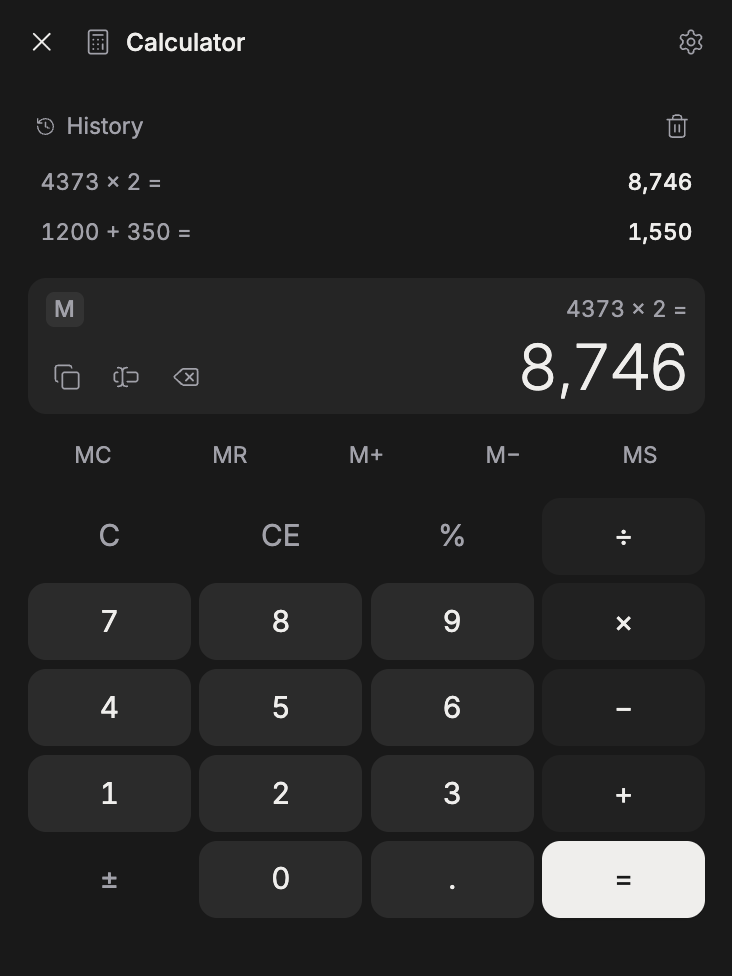

# Calculator

A calculator that lives where the writing is — docked in the side pane of every
file type, and as an optional floating widget.

## Features

- Full four-function keypad with `%`, sign flip, `CE` / `C` and backspace
- **Memory keys** (`MC` `MR` `M+` `M−` `MS`) with an `M` indicator on the display
- A short **history** of finished calculations — tap one to put it back on the display
- **Copy** the result, or **insert** it straight into the open document or sheet
  (result only, or `12 × 4 = 48`, your choice)
- **Keyboard input** while the panel has focus — digits, `+ - * /`, `Enter`, `Backspace`, `Esc`
- Four surfaces from one state: side pane, floating widget, phone tray chip, bottom sheet
- Command: `Calculator: Toggle floating widget`

## Usage

Enable the plugin and a calculator toggle appears in the header of every file —
document, sheet, plotboard, canvas, folder view or task. Click it and the
calculator docks in that file's side pane, beside the editor, where it stays
while you write. On a phone the same view opens from the "..." sheet, and on a
tablet from the header cluster.

Prefer it floating over the text? Settings → Calculator → **Show floating
widget**, or run the toggle command. Both surfaces share one calculation, so a
sum started in the pane is finished in the widget.

Number formatting (thousands separators, decimal places) and what the insert
button writes are in the same settings tab.

## How it works

- **A pure state machine.** [`src/engine.ts`](src/engine.ts) is the calculator:
  keys in, state out, no React and no host API. Every surface, every keystroke and
  the command all go through `applyKey`, which is why the whole of
  [`test/engine.test.ts`](test/engine.test.ts) can test it by pressing keys.
- **One store, every surface.** A module-level singleton
  ([`src/store.ts`](src/store.ts)) holds the live state, and persists _itself_ to a
  `localStorage` key — a half-typed sum is on-device run-state, not a setting worth
  syncing to your phone. Durable preferences live in `app.storage` via the settings
  schema.
- **A pane, not a dialog.** `registerPaneView` docks the calculator beside the
  editor. Arithmetic happens _while_ you are writing — word counts, ages, page
  budgets — and a modal takes away the manuscript you are doing the arithmetic
  about, then closes the moment you touch the text again. Docking is also what
  makes "insert result" worth having: the caret is still where you left it.
- **Every file type, on purpose.** The pane view is registered with no
  `fileTypes` filter. `SurfaceScope` is omit-to-allow, so the toggle appears in
  every file type — including ones pensiv adds later, with no republish.
- **The controls are the app's controls.** [`src/styles.css`](src/styles.css) ports
  `Button` (variants, sizes, `active:scale-[0.98]`, the focus ring) and reads the
  host's tokens, so the keys follow the user's theme and accent. Digits are the
  `muted` variant, corrections are `ghost`, and `=` is the same gradient primary
  button the rest of the app uses.
- **The keyboard is panel-scoped.** Key handling is bound to the panel, never to
  the window: a global listener would swallow digits meant for the manuscript.

## Permissions

- `editor.write` — only for the insert button.
- `clipboard` — only for the copy button.

Neither is touched unless you press the corresponding button.
