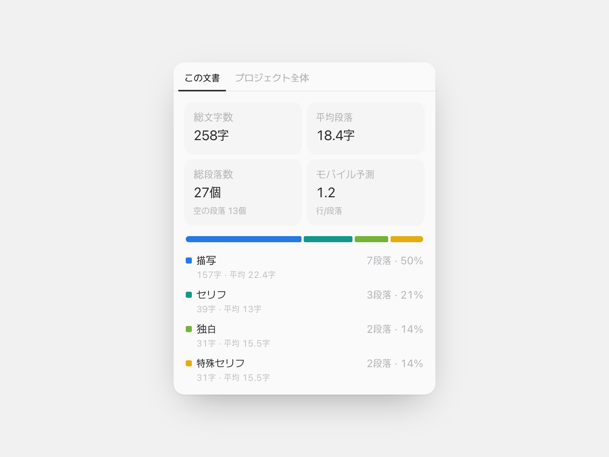

# 段落分析

原稿を開いているあいだ、横で数えつづけるパネルです。描写・セリフ・独白・特殊セリフがそれぞれ何段落で何文字か、
平均段落はどれくらいの長さか、スマートフォンでは何行に見えるかを表示します。



## どう分類するか

見るのは段落の最初の一文字だけです。かぎ括弧や二重引用符で始まればセリフ、丸括弧や一重引用符なら独白、
角括弧・二重かぎ括弧・山括弧なら特殊セリフ、それ以外は描写です。UIの言語ではなく記号を基準にするので、
韓国語の原稿に混ざった `「」` も、英語の原稿のまっすぐな引用符も、そのまま読み取ります。

| 分類           | 始まりの記号                                                |
| -------------- | ----------------------------------------------------------- |
| **セリフ**     | `「 」` `“ ”` `" "` `« »`                                   |
| **独白**       | `（ ）` `( )` `‘ ’` `' '`                                   |
| **特殊セリフ** | `『 』` `【 】` `〔 〕` `〈 〉` `《 》` `［ ］` `[ ]` `{ }` |
| **描写**       | それ以外すべて                                              |
| _(空の段落)_   | 空白のみ — 数えるが分類はしない                             |

セリフの後ろに地の文が続いてもセリフのままです（`「またね」と彼は言った。`）。逆に文の途中に出てくる引用は
セリフになりません。閉じ記号がなければ推測せず描写に残します。アポストロフィを閉じ引用符として数えないので、
`'Tis the season` も描写のままです。全角スペースのインデントは先に取り除いてから判定するため、よそから
貼り付けた原稿もきちんと読めます。

既定値は日本・韓国・英語圏の原稿で実際に使われている慣習に合わせてあり、曖昧な記号は設定で変更できます。
丸括弧を独白ではなくシステムメッセージに使う書き手もいれば、二重かぎ括弧を作品名だけに使う書き手もいます。

英語の原稿で描写の比率が高く出るのは不具合ではありません。英語の内心はイタリックで表現され、プレーン
テキストには痕跡が残らないので、どの記号ルールでも捕まえられないからです。

## 空の段落は別に数えます

段落のあいだに空行を入れて書くと、平均段落長は実際の半分に落ちます。このプラグインは空の段落を別に数えて
平均から除くので、画面に出る数値が実際に書いた分量になります。

数え方も原稿に合わせてあります。

- 文字数はコードポイント単位なので、絵文字や稀用漢字も1文字として数えます。
- Shift+Enterの改行は既定で別の段落です。そうしないとEnterを押さない書き手の原稿が4,000字の段落
  ひとつになります。
- 見出しは対象から外します。章タイトルは本文ではありません。
- モバイル予測は段落ごとの `ceil(長さ ÷ 1行の文字数)` の平均なので、1文字の段落が0行に落ちることは
  ありません。既定は28字（日本語・韓国語）で、英語は45字ほどが適切です。

## そのほか

- この文書とプロジェクト全体をタブで切り替え
- 設定 → 分析にプロジェクト全体の比率カードを追加
- 記号ごとの分類ルール、文字数の数え方、モバイル1行の長さを設定
- コマンドパレットから概要をクリップボードへコピー
- 日本語・韓国語・英語

## 使い方

プラグインを有効にし、文書のヘッダーから **段落分析** を開きます。入力に合わせて数値が追従し、上部のタブで
この文書とプロジェクト全体を行き来します。

## 権限

- `editor.read` — 開いている文書の構造を読みます
- `project.read` — プロジェクト全体の範囲と分析カードに必要です
- `clipboard` — 概要のコピーにのみ使います

---

## プラグイン作者向け

**読み取り専用の分析プラグイン** のリファレンス例です。ProseMirror JSONの走査、デバウンスしたライブパネル、
純粋なエンジンに値を渡す宣言的な設定フォーム、同じ数値を再利用する分析カードを示します。

```bash
# モノレポのルートで
npm install
npm run build -w @pensiv-plugins/paragraph-analysis
node scripts/pack-plugin.mjs plugins/paragraph-analysis   # → paragraph-analysis.pnsv-plugin
```

### 何を示しているか

- `editor.getText()` ではなく `editor.getDoc()`。テキストはブロックを区切り文字で連結するため、空の段落と
  段落の区切りが同じ2つの改行になり、空の段落数を復元できません。ドキュメント走査はそれを保持し、引用や
  リストの中まで入り、コードブロックは飛ばします。
- `editor.on('update')` と400msのトレーリングデバウンス。原稿サイズの走査は安価ですが無料ではなく、キー入力の
  経路で回すと統計パネルが入力の遅延に変わります。
- `project.query({ type: ['document', 'sheet'] })` と `project.content(id).doc` — 同じ走査器を原稿全体に
  適用し、`project.subscribe` で最新に保ちます。
- `addSettingTab({ schema })` — 記号グループごとに `select` ひとつ、`sample` チップで実際の記号を提示。
  エンジンがマッピングを引数で受け取るので、フォームにロジックはありません。
- `registerAnalyticsSection` — プロジェクト全体の比率をホストが描くstatとrowで、パネルと同じ
  `--chart-1..4` のパレットスロットで。

### デザイン — 中身は借り、外枠は借りない

パネルは分析ページの **中身** をそのまま使います。statのタイプスケール（ミュートの `text-sm` ラベル、
`text-lg tracking-tight` の数値、`text-xs` のヒント）、チャートのパレットスロット、100%積み上げバーと凡例、
grow-inとカウントアップのイージング（`cubic-bezier(0.22, 1, 0.36, 1)`）まで同じ値です。

借りなかったのはカードの外枠です。分析ページは設定画面の幅を埋めるためにトレイの中にボーダー付きカードを
重ねますが、344pxのサイドパネルで同じ構造をとると箱の中の箱になり、ボーダーが数値より目立ちます。そこで
トレイをなくし、タイルはボーダーではなく塗りだけにし、チャートはパネルの上に直接置いています。タブを
ピル型ではなく下線型にしたのも同じ理由です — 浮かべるカードがないレイアウトでは、ピルが画面で最も重い要素に
なります。

ホストの `useChartGrowIn` と `RollingNumber` は `motion/react` の裏にあり、プラグインがimportできる
モジュールではないので、[`motion.ts`](src/motion.ts) に同じ曲線・同じ時間・同じreduced-motionルールを
書き写してあります。値を変えるときは両方を直します。

### ロジックの置き場所

[`analyze.ts`](src/analyze.ts) はホストもReactも使わない純粋なモジュールなので、分類器だけを単体でテストでき、
1ファイルの中で議論できます。ほかはすべてその結果の表示です。[`pane.tsx`](src/pane.tsx) が描き、
[`settings.ts`](src/settings.ts) が設定し、[`main.tsx`](src/main.tsx) が4つのサーフェスをつなぎ、
[`test/analyze.test.ts`](test/analyze.test.ts) が上記の落とし穴を含む三言語の挙動を固定します。
