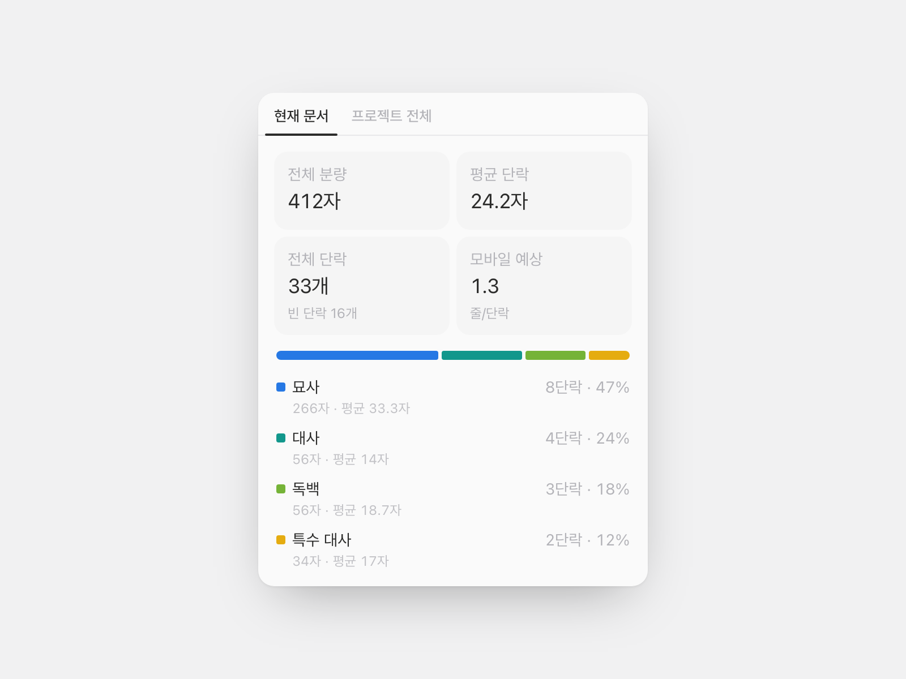

# 단락 분석

원고를 열어 두면 옆에서 계속 세고 있는 패널입니다. 묘사·대사·독백·특수 대사가 각각 몇 단락이고 몇
자인지, 평균 단락은 얼마나 긴지, 휴대폰 화면에서는 몇 줄로 보일지를 보여 줍니다.



## 어떻게 분류하나

단락의 첫 글자만 봅니다. 큰따옴표로 열면 대사, 작은따옴표나 소괄호로 열면 독백, 대괄호·겹낫표·화살괄호로
열면 특수 대사, 나머지는 묘사입니다. UI 언어가 아니라 기호를 기준으로 삼기 때문에 한국어 원고에 섞인
「」도, 영어 원고의 곧은 따옴표도 그대로 읽어냅니다.

| 갈래          | 시작 기호                                                   |
| ------------- | ----------------------------------------------------------- |
| **대사**      | `“ ”` `" "` `「 」` `« »`                                   |
| **독백**      | `‘ ’` `' '` `( )` `（ ）`                                   |
| **특수 대사** | `[ ]` `［ ］` `【 】` `〔 〕` `〈 〉` `《 》` `『 』` `{ }` |
| **묘사**      | 그 밖의 모든 단락                                           |
| _(빈 단락)_   | 공백뿐인 단락 — 세기는 하되 갈래에는 넣지 않음              |

지문이 뒤에 붙은 대사(`"안녕." 그가 웃었다.`)는 대사로 셉니다. 반대로 문장 중간에 인용이 들어간 경우는
묘사입니다. 닫는 기호가 없으면 추측하지 않고 묘사로 남겨 둡니다. 아포스트로피도 닫는 따옴표로 세지
않기 때문에 `'Tis the season`은 묘사로 남습니다. 전각 공백으로 들여쓴 원고는 들여쓰기를 먼저 걷어내고
판정하므로 다른 데서 붙여 넣은 원고도 제대로 읽습니다.

기본값은 한국·영미·일본 원고에서 실제로 쓰이는 관습을 따랐고 애매한 기호는 설정에서 바꿀 수 있습니다.
소괄호를 독백이 아니라 특수 대사로 쓰는 작가도 있고 겹낫표를 작품명에만 쓰는 작가도 있으니까요.

영어 원고에서 묘사 비중이 높게 나오는 건 오류가 아닙니다. 영어의 속마음은 이탤릭으로 표현되는데,
평문에는 그 흔적이 남지 않아 어떤 기호 규칙으로도 잡을 수 없습니다.

## 빈 단락을 따로 셉니다

단락 사이에 빈 줄을 넣고 쓰면 평균 단락 길이가 실제의 절반으로 떨어집니다. 이 플러그인은 빈 단락을 따로
세고 평균에서 제외하기 때문에 화면에 나오는 숫자가 실제로 쓴 분량입니다.

그 밖에 세는 방식도 원고 쪽에 맞춰져 있습니다.

- 글자 수는 코드 포인트 기준이라 이모지나 희귀 한자도 한 글자로 셉니다.
- Shift+Enter 줄바꿈은 기본적으로 별개의 단락입니다. 그러지 않으면 Enter를 누르지 않는 사람의 원고가
  4,000자짜리 단락 하나로 나옵니다.
- 제목은 아예 빼고 셉니다. 챕터 제목은 본문이 아닙니다.
- 모바일 예상은 단락마다 `ceil(길이 ÷ 한 줄 글자 수)`를 구해 평균한 값이라, 한 글자짜리 단락도 0줄로
  내려가지 않습니다. 기본 28자(한국어·일본어)이고 영어는 45자쯤이 맞습니다.

## 그 밖에

- 현재 문서와 프로젝트 전체를 탭으로 전환
- 설정 → 분석 페이지에 프로젝트 전체 비율 카드 추가
- 기호별 분류 규칙, 글자 수 세는 방식, 모바일 한 줄 길이 설정
- 명령 팔레트에서 요약을 클립보드로 복사
- 한국어·영어·일본어

## 사용법

플러그인을 켜고 문서 헤더에서 **단락 분석**을 엽니다. 타이핑에 따라 숫자가 따라오고, 위쪽 탭으로
현재 문서와 프로젝트 전체를 오갑니다.

## 권한

- `editor.read` — 열려 있는 문서의 구조를 읽습니다
- `project.read` — 프로젝트 전체 범위와 분석 카드에 필요합니다
- `clipboard` — 요약 복사에만 사용합니다

---

## 플러그인 작성자용

**읽기 전용 분석 플러그인**의 참고 예제입니다. ProseMirror JSON 순회, 디바운스된 실시간 패널,
순수 엔진에 값을 넘기는 선언형 설정 폼, 같은 수치를 재사용하는 분석 카드를 보여 줍니다.

```bash
# 모노레포 루트에서
npm install
npm run build -w @pensiv-plugins/paragraph-analysis
node scripts/pack-plugin.mjs plugins/paragraph-analysis   # → paragraph-analysis.pnsv-plugin
```

### 무엇을 보여 주나

- `editor.getText()`가 아니라 `editor.getDoc()`. 텍스트는 블록을 구분자로 이어 붙이기 때문에 빈
  단락과 단락 구분이 똑같은 줄바꿈 두 개가 되고, 빈 단락 수를 되살릴 수 없습니다. 문서 순회는 그걸
  보존하고, 인용구와 목록 안쪽까지 들어가며, 코드 블록은 건너뜁니다.
- `editor.on('update')` + 400ms 트레일링 디바운스. 원고 크기의 순회는 싸지만 공짜는 아니고, 키 입력
  경로에서 돌리면 통계 패널이 타이핑 렉으로 변합니다.
- `project.query({ type: ['document', 'sheet'] })` + `project.content(id).doc` — 같은 순회기를 원고
  전체에 적용하고, `project.subscribe`로 최신 상태를 유지합니다.
- `addSettingTab({ schema })` — 기호 그룹마다 `select` 하나, `sample` 칩으로 실제 기호를 노출. 엔진이
  매핑을 인자로 받으므로 폼에는 로직이 없습니다.
- `registerAnalyticsSection` — 프로젝트 전체 비율을 호스트가 그리는 stat/row로, 패널과 같은
  `--chart-1..4` 팔레트 슬롯으로.

### 디자인 — 알맹이는 가져오고 껍데기는 두고 온다

패널은 분석 페이지의 **본체**를 그대로 씁니다. stat 타입 스케일(뮤티드 `text-sm` 라벨 + `text-lg
tracking-tight` 수치 + `text-xs` 힌트), 차트 팔레트 슬롯, 100% 누적 막대와 범례, grow-in·카운트업
이징(`cubic-bezier(0.22, 1, 0.36, 1)`)까지 값이 같습니다.

가져오지 않은 건 카드 껍데기입니다. 분석 페이지는 설정 화면 너비를 채우려고 트레이 안에 보더 있는
카드를 겹치는데, 344px 사이드 패널에서 같은 구조를 쓰면 상자 안의 상자가 되고 보더가 수치보다 커집니다.
그래서 트레이를 없애고, 타일은 보더 대신 채움만 남기고, 차트는 패널 위에 바로 얹었습니다. 탭도 같은
이유로 알약형 대신 밑줄형입니다 — 띄울 카드가 없는 레이아웃에서 알약은 화면에서 가장 무거운 물체가
됩니다.

호스트의 `useChartGrowIn`·`RollingNumber`는 `motion/react` 뒤에 있고 플러그인이 import할 수 있는
모듈이 아니라, [`motion.ts`](src/motion.ts)에 같은 곡선·같은 시간·같은 reduced-motion 규칙으로
옮겨 두었습니다. 값이 바뀌면 양쪽을 같이 고쳐야 합니다.

### 로직 위치

[`analyze.ts`](src/analyze.ts)는 호스트도 React도 없는 순수 모듈이라, 분류기만 따로 테스트하고 한 파일
안에서 논쟁할 수 있습니다. 나머지는 전부 그 결과의 표현입니다. [`pane.tsx`](src/pane.tsx)가 그리고,
[`settings.ts`](src/settings.ts)가 설정하고, [`main.tsx`](src/main.tsx)가 네 표면을 연결하고,
[`test/analyze.test.ts`](test/analyze.test.ts)가 위의 함정들을 포함해 세 언어 동작을 고정합니다.
